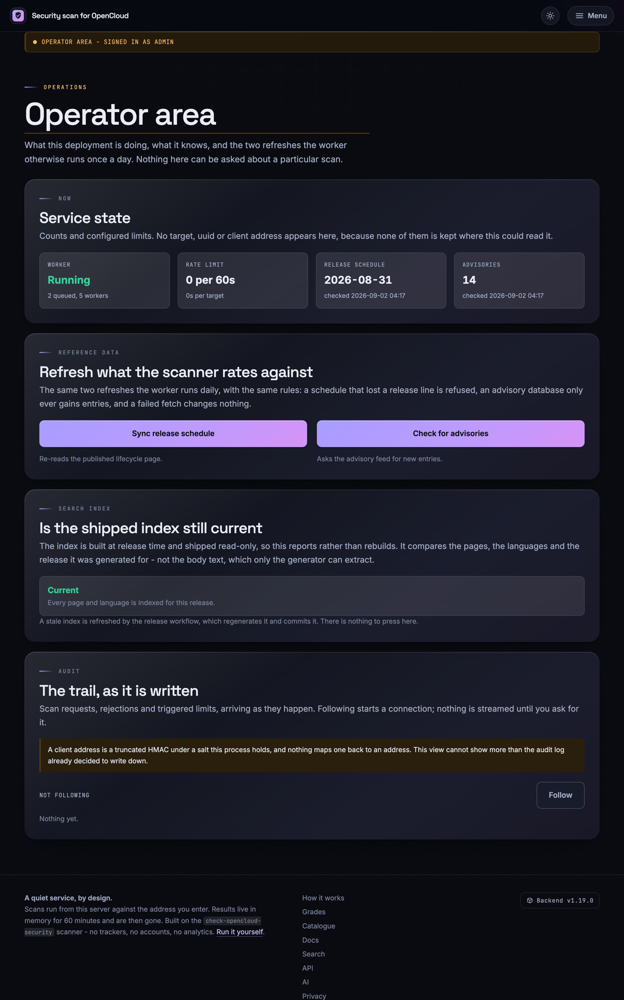
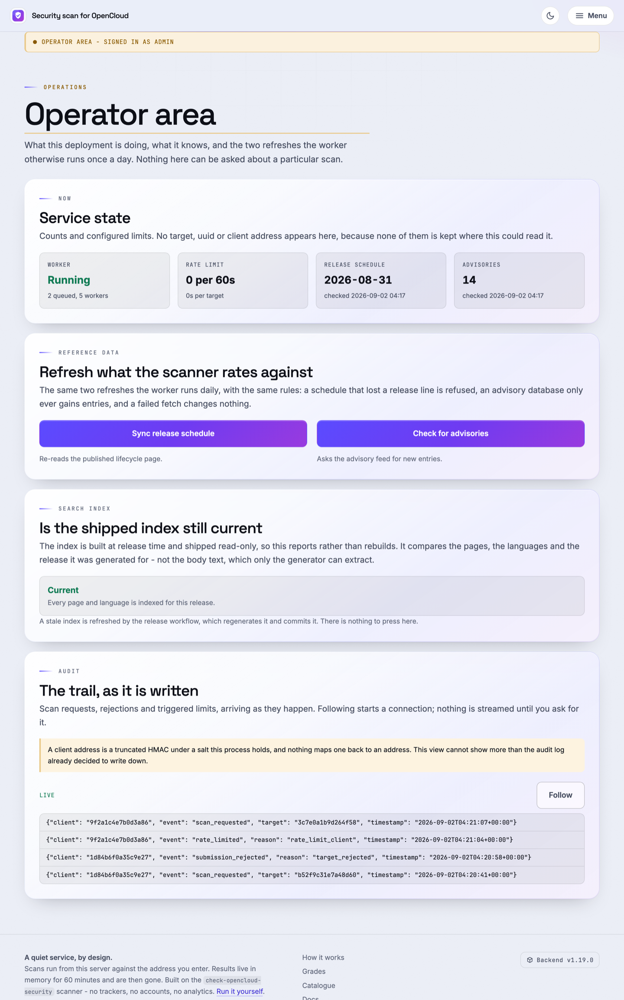

# ADMIN.md

Internal operations notes for system administrators who run or maintain this
repository and its deployments.

This document is **not** published. It is deliberately absent from every
manifest that ships something outward:

| Artefact | Why ADMIN.md stays out |
|:--|:--|
| PyPI wheel | `[tool.hatch.build.targets.wheel] only-include` names only `check_opencloud_security.py` and `opencloud_local_scan` |
| PyPI sdist | `[tool.hatch.build.targets.sdist] include` is an explicit file list |
| Web bundle | `scripts/build_web_bundle.py` copies a named list of files |
| `/documentation` | Generated only from the pages in `webapp/documentation.py` |
| Site search | `webapp/search.py` lists the public templates explicitly |

Adding this file to any of those lists would publish it, so don't.

For *developer* rules — architecture, layer boundaries, ADR policy, the
release process — read `AGENTS.md`. For diagnosing a *scan* that reports
something odd, read `docs/troubleshooting.md`. This file covers the part in
between: keeping the data current, rebuilding what is generated, and knowing
where to look when the service misbehaves.

## Contents

- [The two data files everything depends on](#the-two-data-files-everything-depends-on)
- [What updates itself, and when](#what-updates-itself-and-when)
- [Updating the vulnerability database](#updating-the-vulnerability-database)
- [Updating the release schedule (new OpenCloud versions)](#updating-the-release-schedule-new-opencloud-versions)
- [Refreshing data on a monitoring host](#refreshing-data-on-a-monitoring-host)
- [Rebuilding the frontend documentation](#rebuilding-the-frontend-documentation)
- [Rebuilding the search index](#rebuilding-the-search-index)
- [Building the web bundle](#building-the-web-bundle)
- [A local instance for testing the frontend](#a-local-instance-for-testing-the-frontend)
- [The web service refreshes itself at runtime](#the-web-service-refreshes-itself-at-runtime)
- [The operator's area at /admin](#the-operators-area-at-admin)
- [Where to look when something breaks](#where-to-look-when-something-breaks)
- [When OpenCloud moves its documentation](#when-opencloud-moves-its-documentation)
- [Limitations worth knowing before somebody asks](#limitations-worth-knowing-before-somebody-asks)
- [Things an administrator must never do](#things-an-administrator-must-never-do)

## The two data files everything depends on

```
opencloud_local_scan/data/vulnerabilities.json   # which versions are affected by what
opencloud_local_scan/data/release_schedule.json  # which release lines are still supported
```

Every grade this project produces starts from those two files. A stale
vulnerability database does not grade an instance generously — it tells
somebody a vulnerable instance is fine. A stale release schedule turns an
end-of-life instance into an unknown one. Treat both as security-relevant
data, not as content.

Both are refreshed by CI and committed to the repository. A human reviews the
pull request; nothing rewrites them in production.

## What updates itself, and when

| Workflow | Cadence (UTC) | What it does |
|:--|:--|:--|
| `vulnerability-db.yml` | daily, 05:41 | Re-reads OSV, opens a PR if the database changed |
| `release-schedule.yml` | Mondays, 04:17 | Re-reads the lifecycle page, opens a PR with the JSON and the README block |
| `check-opencloud-links.yml` | Tuesdays, 05:41 | Re-checks every documented OpenCloud link |
| `supply-chain.yml` | Mondays, 04:17 | Dependency/supply-chain review |
| `bandit.yml` | Wednesdays, 17:38 | Static security analysis |
| `integration-opencloud-container.yml` | Saturdays, 03:17 | Scans a real OpenCloud container |
| `attest-security-data.yml` | push to `main` touching either data file | Signs them with Sigstore |

The first three accept `workflow_dispatch`, so the normal way to force a
refresh is to run the workflow from the Actions tab rather than to run the
script by hand. Run the scripts locally when the workflow itself is broken,
when you are working offline, or when you want to see the diff before it
becomes a pull request.

## Updating the vulnerability database

```bash
python scripts/update_vulnerability_db.py             # fetch and write
python scripts/update_vulnerability_db.py --check     # report only, write nothing
```

Useful flags:

| Flag | Default | Purpose |
|:--|:--|:--|
| `--url` | `https://api.osv.dev/v1/query` | Point at a mirror or an internal feed |
| `--package` | `github.com/opencloud-eu/opencloud` | Ask about a different module |
| `--timeout` | `30` | Seconds |
| `--check` | off | Exit non-zero if the file is out of date; write nothing |
| `--allow-failure` | off | Exit `0` when the feed is unreachable (for scheduled runs) |

**A refresh only ever adds.** An advisory the feed no longer mentions stays in
the file, because a feed that has forgotten a vulnerability has not fixed it.
Removing an entry is a deliberate edit by a person — which is also the only
way something gets in that OSV does not know about.

After running it, inspect the diff before committing. What you want to see is
new entries and enriched ranges. What should worry you is entries
disappearing, or an entry that names no version range at all (it would match
every release ever made).

## Updating the release schedule (new OpenCloud versions)

This is the script to reach for when OpenCloud ships a release and the scanner
does not know about it yet.

```bash
python scripts/update_release_schedule.py             # fetch, write JSON + README block
python scripts/update_release_schedule.py --check     # report only
python scripts/update_release_schedule.py --no-readme # leave the README block alone
```

| Flag | Default | Purpose |
|:--|:--|:--|
| `--url` | `https://docs.opencloud.eu/docs/admin/resources/lifecycle/` | Lifecycle page or mirror |
| `--timeout` | `30` | Seconds |
| `--check` | off | Exit non-zero if out of date |
| `--no-readme` | off | Write only the JSON |
| `--allow-failure` | off | Exit `0` when the page cannot be read or parsed |

It writes **both** `opencloud_local_scan/data/release_schedule.json` and the
generated block in `README.md` between
`<!-- release-schedule:start -->` and `<!-- release-schedule:end -->`.

- Never hand-edit that README block. The next refresh overwrites it, and
  `tests/test_update_script.py` fails when it does not match the schedule
  shipping beside it.
- Removing the markers is an error, not a no-op — a README that quietly stops
  updating is worse than one that never did.
- The prose and worked examples *around* the block are hand-written and
  deliberately name older releases. Leave them alone.

The lifecycle page is the only place the release *type* is stated. The GitHub
release list cannot tell a rolling release from a production one, so if the
lifecycle page is unavailable there is no fallback source — the schedule
simply stays as it is.

**Expect a newer version to be less supported than an older one.** Rolling,
production and LTS ship side by side. That is not a bug to fix.

## Refreshing data on a monitoring host

An installed plugin carries whatever data shipped in its release. Between
releases, a monitoring host can pull the reviewed data without upgrading the
package:

```bash
check-opencloud-scanner refresh-data
# ~/.cache/check-opencloud-security/release_schedule.json
# ~/.cache/check-opencloud-security/vulnerabilities.json
```

| Flag | Default | Purpose |
|:--|:--|:--|
| `--output-dir` | `~/.cache/check-opencloud-security` | Where the two JSON files land |
| `--schedule-url` | *(unset)* | Fetch the lifecycle page live instead |
| `--advisory-url` | *(unset)* | Query OSV (or a mirror) live instead |
| `--timeout` | `30` | Seconds |

**With no URL given**, both documents come from this project's own repository
on `main` — the files a human already reviewed and merged — and a Sigstore
attestation is verified before anything is believed (ADR 0027). This is the
path you want.

**With an explicit URL**, the source is queried live and nothing signs it; only
the structural guards apply, and the command logs a warning saying so. Use it
for an air-gapped mirror or a fork, not because it seems more current.

Structural guards apply either way: a schedule that lost a line the bundled
file knows is refused, and an advisory database with no usable bounded entries
is refused.

The chain behind that signature is worth understanding, because it is what a
monitoring host is trusting: the refresh workflows open a pull request, a
human merges it, and `attest-security-data.yml` then signs the merged files on
`main` with a short-lived Sigstore certificate bound to that workflow's
identity. There is no signing key to leak, and the human merge is the review
boundary the attestation certifies. `opencloud_local_scan/data_signing.py`
pins the expected issuer, workflow path and ref, and fails closed when an
attestation exists but does not match.

Then point the scanner at the files, in the configuration file:

```yaml
scanner:
  release_schedule: /var/lib/check-opencloud-security/release_schedule.json
  vulnerability_db:
    - /var/lib/check-opencloud-security/vulnerabilities.json
```

or by environment variable — `COS_SCANNER_RELEASE_SCHEDULE`,
`COS_SCANNER_VULNERABILITY_DB` (lists are joined with `;`). Precedence is
**CLI flag > environment variable > file > default**.

A sensible cron entry refreshes daily, well before the scans that use it, and
alerts on a non-zero exit rather than failing silently.

## Rebuilding the frontend documentation

`/documentation` is a **build-time** artefact. Production serves checked-in
HTML templates and has no Markdown parser.

```bash
python scripts/build_frontend_documentation.py           # regenerate
python scripts/build_frontend_documentation.py --check   # fail if stale (CI runs this)
```

- Sources: `README.md`, `opencloud_local_scan/README.md` and selected files in
  `docs/`, listed in the manifest `webapp/documentation.py`.
- Output: `frontend/templates/docs/*.html`.
- Run it after editing any source it lists, and commit the regenerated HTML.
  CI rejects stale output.
- Never hand-edit the generated HTML. The next build discards it.

Generated guide bodies stay English under `lang="en"` with localized chrome
(ADR 0020) — that is intentional, not a missing translation.

## Rebuilding the search index

```bash
python scripts/build_search_index.py            # regenerate
python scripts/build_search_index.py --check    # fail if stale
```

Output:

```
frontend/static/search-index.json      # English: every page and its text
frontend/static/search-index.de.json   # overlays: translated chrome only
frontend/static/search-index.es.json
frontend/static/search-index.fr.json
```

The generator is given an explicit list of public templates in
`webapp/search.py`. It has no store, no API, no result template, no export, no
UUID and no network input — scan results and submitted addresses are
structurally impossible to index, and it must stay that way. Only the release
workflow refreshes these files in the normal course of things.

## Building the web bundle

The web application never ships to PyPI. It ships as a tarball:

```bash
python scripts/build_web_bundle.py
# dist/check_opencloud_security_web.tar.gz  (+ .sha256)
```

This is not part of `pytest`, so run it after touching `webapp/` or
`frontend/`. `tests/test_webapp_packaging.py` builds the real artefacts and
fails if `webapp/` or `frontend/` ever leak into the wheel or sdist.

## A local instance for testing the frontend

A disposable stack — web application, worker and Redis — built from your own
working tree, so you can look at the site in a browser before anything is
published.

### The one-command version

If you only want the stack as it ships, with no configuration of your own:

```bash
cd docker
docker compose up --build
# http://127.0.0.1:8811
```

The shipped `docker/docker-compose.yml` already builds from the repository
root (`context: ..`), so this is the whole thing. Its one limitation for
testing is the important one: it sets
`COS_WEB_ALLOW_PRIVATE_TARGETS: "false"`, so the SSRF guard refuses every
private, loopback and link-local address — which is exactly where your test
OpenCloud instance lives. You get the site, but you cannot complete a scan
against anything local.

### The wizard version, which is the one you want

`docker/setup-wizard.py` writes a stack configured for this. It is standalone,
uses the standard library only, and shares nothing with the plugin's
`--configure` wizard.

```bash
cd docker
./setup-wizard.py \
    --non-interactive \
    --preset private \
    --output-dir ~/scan-test \
    --compose-file docker-compose.local.yml \
    --env-file .env.local
```

What each part is doing, and why:

| Flag | Why it matters here |
|:--|:--|
| `--preset private` | Sets `COS_WEB_ALLOW_PRIVATE_TARGETS=true`, so a scan of a local instance is allowed at all. Also turns indexing off and the audit log on |
| `--non-interactive` | Takes every default and generates the credentials. Drop it to be asked question by question, with an explanation and an example answer for each |
| `--output-dir ~/scan-test` | **Write outside the repository.** See the warning below |
| `--compose-file` / `--env-file` | Any name but the four that ship. The wizard refuses `docker-compose.yml`, `docker-compose.dockerhub.yml`, `docker-compose.authentik.yml` and `docker-compose.monitoring.yml` outright, because the next `git pull` would take a hand-made deployment with it |

The image source defaults to `build`, not to the published Docker Hub image,
and the wizard resolves the build context to the repository root as an
**absolute** path. That is what makes `--output-dir` anywhere work while still
building the code in front of you.

Then:

```bash
cd ~/scan-test
docker compose -f docker-compose.local.yml up -d --build
open http://127.0.0.1:8811
```

> **Write the generated files outside the repository.** `.env.local` holds a
> generated Redis password, purge token, purge and export signing keys and the
> audit salt, and it is **not** covered by `.gitignore` — the `.env` pattern
> there matches a file called exactly `.env`, not `.env.local`. Generated
> inside `docker/` it shows up as untracked and a broad `git add` will take
> it. The wizard creates it `0600`, which protects it from other users on the
> host, not from you committing it.

Two behaviours of the wizard that will otherwise confuse you:

- **Re-running it edits rather than regenerates.** An existing env file is
  read back and its values become the defaults, so credentials survive a
  second run.
- **Non-interactively, a second run into the same directory prints
  `Nothing written.` and stops.** The overwrite prompt defaults to *no*, and a
  non-interactive run takes that default. Pass `--force` when you mean to
  replace the files.

### The fast edit loop

Rebuilding the image for a CSS tweak is not the loop you want. Bind-mount the
frontend instead — the image puts it at `/app/frontend`, and both the template
loader and the static mount read from disk:

```yaml
# ~/scan-test/docker-compose.override.yml
services:
  web_app:
    volumes:
      - /path/to/check-opencloud-security/frontend:/app/frontend:ro
```

```bash
docker compose -f docker-compose.local.yml -f docker-compose.override.yml up -d
```

Now a change to a template, to `app.css` or to anything under
`frontend/static/js/` shows on the next page load. What still needs a restart:

- anything under `webapp/` — the Python is baked into the image, and uvicorn
  runs without `--reload` on purpose;
- `frontend/static/llms.txt` and `llms-full.txt`, which are read once at
  startup;
- `frontend/templates/docs/*.html`, which you regenerate with
  `scripts/build_frontend_documentation.py` rather than editing.

`COS_WEB_FRONTEND_DIR` does the same job if you would rather mount somewhere
else and point the application at it.

### Giving it something to scan

Scans run **from the worker container**, so `localhost` in the form means that
container, not your machine. To reach an OpenCloud instance running on the
host, use `host.docker.internal` (Docker Desktop) or the host's address on the
Docker bridge; to reach one in another container, put both stacks on the same
Docker network and use the service name.

Without a real instance you can still exercise most of the frontend: the form,
validation, the queue and progress states, the 404 for an expired uuid, the
catalogue, the documentation pages and every static page. A scan that cannot
connect completes as a *failed* scan and renders the failure page, which is
itself worth looking at.

`tests/fake_opencloud.py` is a real HTTP server driven by an
`InstanceBehaviour` dataclass, and it is the honest way to render a *result*
page with findings on it without needing an OpenCloud deployment.

### Tearing it down

```bash
cd ~/scan-test
docker compose -f docker-compose.local.yml down -v   # -v also drops the Redis volume
rm docker-compose.local.yml .env.local
```

Results live in Redis with a TTL and nothing is written to disk by the
application itself, so `down -v` leaves nothing behind.

## The web service refreshes itself at runtime

The schedule CI commits is frozen the moment an image is built, so the worker
re-reads both documents once a day and keeps them in Redis, where each scan
picks them up. Nothing is written to disk.

| Setting | Default | Purpose |
|:--|:--|:--|
| `COS_WEB_SCHEDULE_REFRESH` | on | Daily lifecycle re-read |
| `COS_WEB_SCHEDULE_REFRESH_HOUR` | `4` | Hour (UTC) of the daily read. Worth varying between deployments so they do not all arrive at once |
| `COS_WEB_SCHEDULE_REFRESH_URL` | lifecycle page | Override the source |
| `COS_WEB_ADVISORY_REFRESH` | on | Daily advisory re-read |
| `COS_WEB_ADVISORY_REFRESH_URL` | OSV | Override the source |

Redis keys, if you need to look:

```
cos:web:schedule:document     cos:web:schedule:checked
cos:web:advisories:document   cos:web:advisories:checked
```

The acceptance rules are the whole safety model, and they are asymmetric on
purpose:

- A candidate schedule is accepted only when it still knows **every line the
  bundled file knows**. Losing a line turns an end-of-life instance into an
  unknown one.
- A refresh only ever **adds** advisories. A feed answering with an empty list
  changes nothing.
- **Nothing unbounded is ever believed.** An advisory naming no versions
  matches every release there has ever been, and public feeds do publish that
  shape.
- An absurd number of advisories is refused whole.
- Any failure leaves the database exactly as it was.
- A newer bundled file wins after a redeployment.

So the correct response to "the refresh was rejected" is to look at what
upstream published, not to relax the rule.

## The operator's area at /admin

Optional, off by default, and worth knowing the shape of before you turn it
on.

```bash
COS_WEB_ADMIN_ENABLED=true
COS_WEB_ADMIN_PROXY_SECRET=<32+ characters, generated>
COS_WEB_ADMIN_USERS=okko;sam
```

The wizard asks for all three (`docker/setup-wizard.py`, the "operator's area"
section) and generates the secret into `.env`.

**Off means absent, not protected.** With `COS_WEB_ADMIN_ENABLED` unset the
routes are never registered and `/admin` answers the same 404 as any other
unknown path, so a deployment that does not use the area does not disclose
that the area exists.

**The service authenticates nobody.** An authentik proxy provider signs the
operator in and forwards the identity as headers; the service believes those
headers only because the proxy also sends `COS_WEB_ADMIN_PROXY_SECRET` as
`X-COS-Admin-Proxy`. Two consequences worth internalising:

- **Reaching the container directly gets you nothing.** Another container on
  the same Docker network, or a port you accidentally published, answers 404
  without that header.
- **If you put your own reverse proxy in front instead of the bundled
  Authentik, you must add that header yourself.** Otherwise the area is
  unreachable - which is the failure mode you want, but it will look like a
  bug. `authentik/blueprints/opencloud-admin.yaml` provisions the provider,
  the operator group and the outpost for the bundled stack.

**A deployment that cannot enforce the sign-in refuses to start.** No secret,
a secret under 32 characters, or an empty `COS_WEB_ADMIN_USERS` all raise at
startup rather than serving an open console. An empty user list is never read
as "anybody authentik authenticated".

**Signing out is the provider's job too.** The service has no session to end,
so the band's *Sign out* link only appears once you say where the exit is:

```bash
COS_WEB_ADMIN_SIGN_OUT_URL=/outpost.goauthentik.io/sign_out
```

That path is the bundled stack's answer - the same reverse proxy that routes
`/outpost.goauthentik.io/` for the forward auth serves it, so a deployment
where signing in works has it. The wizard writes it for you when the bundled
Authentik is in the stack; with your own provider, name its exit instead.
Leave it unset and the band names the operator and offers no way out, which
is better than a control that appears to sign somebody out and does not. Only
a local path or an `http(s)` URL is accepted - the value is rendered into an
`href` on a page whose content policy exists to keep script off it, so
anything else refuses to start.

What the area does:

| Card | What it does |
|:--|:--|
| Service state | Worker liveness, queue depth, the configured limits, and when each reference document was last read. The worker tile has three answers, not two: the heartbeat it reads is a key in Redis, so **Cannot tell** means the store did not answer and nothing was learned about the worker either way |
| What this deployment offers | `/mcp` and whether a token is required, `/docs`, indexing, private-network targets, encryption at rest, and what the audit trail keeps and where. Settings rather than readings, so the card is rendered once and never polled - a value that changed did so in a process the open page is no longer talking to |
| Reference data | Runs the same daily `refresh_schedule` / `refresh_advisories` the worker does, with the same guards, behind a 60-second per-action cooldown |
| Search index | **Reports** whether the shipped index still matches this build. It never rebuilds - that stays the release workflow's job |
| Audit | Streams the audit records as they are written, from the log file when one is configured and otherwise from a bounded in-memory ring |

What it deliberately cannot do: name a target, a uuid, a result or a client
address. The statistics are counts and settings, and the audit view shows the
pseudonymised records the log already wrote - a fingerprint is a truncated
HMAC under a salt the process holds, and nothing maps one back.

**The readings say how old they are.** They are polled every ten seconds, and
a poll that stops answering would otherwise be indistinguishable from a
service with nothing happening on it - the numbers just stop moving. So the
page stamps the age of the last answer, counts it up between polls, and says
plainly when what you are looking at is the last reading the service gave
rather than the current one. A tile lights when its value changes. The page
stops polling while its tab is in the background and re-reads the moment you
come back to it.

**Two combinations on the exposure card carry the warning accent, and only
two.** Neither setting is a mistake in itself, which is why they are marked
rather than refused: `/mcp` served without a token is what a public scanner
is for, and scanning private addresses is the whole point of a deployment
watching its own estate. What is worth a second look is *the pair* -
`COS_WEB_ALLOW_PRIVATE_TARGETS` on a deployment that also asks to be indexed
is a scanner strangers can find, pointed at the network it stands in. If that
is deliberate, `COS_WEB_ALLOW_INDEXING=false` is almost certainly the setting
that was meant.

**Test the sources** is the dry run beside those two buttons: it performs the
same fetch and the same guards and then discards the result, so you can tell
a `failed` (unreachable, or the page changed shape) from a `rejected` (read
fine, refused by the guards) without applying anything. It reaches upstream,
so it is held back by `COS_WEB_ADMIN_REFRESH_COOLDOWN` - under its own key,
so it is available in the moment after a refresh failed. Beside them, *Read
again*, *Copy diagnostics* (the `/admin/state` document on the clipboard, for
an issue report) and the audit list's *Clear* change nothing anywhere.

Two things the audit card will tell you that are worth knowing in advance.
The stream is closed by the service after 30 minutes and says so, rather than
going quiet - press *Follow* for another. And **without
`COS_WEB_AUDIT_LOG_FILE` the window is a ring in one process's memory**, so
behind more than one replica you are watching the records of whichever
replica answered; the card says so where that is the case. Configure the file
if you need the whole trail.





The area is never advertised: `noindex, nofollow, noarchive`, and absent from
the sitemap, `llms.txt`, `/openapi.json`, the documentation manifest and the
search index. It is deliberately **not** in `robots.txt` either, because a
`Disallow` line is a public file naming the path.

## Where to look when something breaks

### First stop: `/healthz`

```bash
curl -s https://your-deployment.example.com/healthz | jq
```

Returns `status`, `version`, `queueDepth`, `worker`, plus `releaseSchedule`
and `advisories` — dates, never a target, which is enough to see whether the
daily refresh is actually happening. It answers **503** when Redis is
unavailable or the worker is not alive. A 503 here almost always means the
ARQ worker died or lost Redis, not that the web process is broken.

### Logger names

Every component logs under its own name, so you can raise or lower one
without drowning in the rest:

```
check_opencloud.web            check_opencloud.web.worker
check_opencloud.web.schedule   check_opencloud.web.advisories
check_opencloud.web.reference  check_opencloud.web.queue
check_opencloud.web.mcp        check_opencloud.web.mcp.auth
check_opencloud.web.runner     check_opencloud.web.audit
check_opencloud.data_signing   check_opencloud.refresh_data
```

### The markers to grep for

Scan lifecycle (each followed by a uuid, and nothing else):

```
scan_created  scan_started  scan_completed
scan_failed   scan_timeout  scan_rejected   scan_expired
```

Reference data:

```
schedule_refresh_updated    schedule_refresh_unchanged
schedule_refresh_failed     schedule_refresh_rejected
schedule_refresh_error      schedule_stored_superseded
advisory_refresh_updated    advisory_refresh_unchanged
advisory_refresh_failed     advisory_refresh_rejected
advisory_refresh_error      advisory_stored_rejected
reference_read_failed
```

`*_rejected` means the fetch succeeded and the guards refused the content —
that is the interesting one. `*_failed` is a network or parse problem.

Access and authorization:

```
purge_throttled   purge_denied      api_docs_enabled
submission_cross_site               language_cross_site
mcp_auth_configured_but_endpoint_disabled
mcp_token_rejected reason=…         (DEBUG level)
forwarded_for_ignored reason=…      (DEBUG level)
```

### What the logs deliberately do not contain

**No target URLs, no client addresses, no results.** A log of what everybody
scanned is a database of what everybody scanned. This is a design rule, not an
oversight — which means you *cannot* answer "which instance did that failing
scan point at?" from the logs, and you are not supposed to be able to. Debug
with the uuid the reporter gives you, within the result TTL.

The optional audit log (`COS_WEB_AUDIT_LOG*`, salted via
`COS_WEB_AUDIT_SALT`) is the deliberate, configurable exception. Read
`docs/webapp.md` before turning it on.

### Common shapes of failure

| Symptom | Where to look first |
|:--|:--|
| `/healthz` 503 | Worker container, then Redis connectivity (`COS_WEB_REDIS_URL`). The operator's area separates the two for you: **Not answering** on the worker tile is the store confirming the worker has written no heartbeat, **Cannot tell** is the store itself being unreachable, which is evidence about neither |
| Submissions accepted, nothing completes | `check_opencloud.web.worker`; queue depth in `/healthz` |
| Everything 404s on a valid-looking scan link | Result TTL expired (`COS_WEB_RESULT_TTL`); unknown/invalid/expired all answer 404 by design |
| Grades look generous | Advisory refresh rejected or stale — check `advisories` in `/healthz` |
| An instance is graded unknown instead of EOL | Schedule refresh rejected or stale |
| Agents can reach `/mcp` unauthenticated | `COS_WEB_MCP_AUTH_ENABLED` plus an issuer must both be set; a deployment that asked for a sign-in it cannot enforce refuses to start |
| Rate limits hitting legitimate users | `COS_WEB_IP_RATE_LIMIT` / `COS_WEB_IP_RATE_WINDOW` / `COS_WEB_TARGET_COOLDOWN`; behind a proxy also `COS_WEB_TRUST_FORWARDED_FOR` and `COS_WEB_TRUSTED_PROXY_HOPS` |
| Scans of internal hosts refused | That is the SSRF guard. `COS_WEB_ALLOW_PRIVATE_TARGETS` exists but think hard before a public deployment sets it |

For the plugin rather than the service, `docs/troubleshooting.md` covers
`UNKNOWN` states, certificate errors, wrong-looking versions, exit codes and
the GitHub rate limit on the update check.

## When OpenCloud moves its documentation

Almost everything this project knows about OpenCloud is anchored in links that
are not under our control: the lifecycle page the schedule is generated from,
the advisories, the source files that prove a hardening flag is hardcoded, the
installation guides. When OpenCloud reorganises, those rot silently — and a
finding explained with a dead link is a finding nobody can act on.

```bash
python scripts/check_documentation_links.py              # check and fail
python scripts/check_documentation_links.py --warn-only  # report only
python scripts/check_documentation_links.py --list       # no network at all
python scripts/check_documentation_links.py --strict     # treat a redirect as out of date
```

Two sources feed it: every text file in the repository, and the hardening
catalogue itself, imported rather than grepped — a reference split across two
string literals is invisible to a regular expression, and those are exactly
the long, deeply nested URLs most likely to move.

**A status code is not enough for `docs.opencloud.eu`.** It is a single-page
application: it answers a dead address with HTTP 200 and the application
shell, then renders "Page not found" in the browser. Every dead documentation
link this project has ever had looked perfectly healthy to a status check. So
links to that site are checked against its own `sitemap.xml` as well — a
`/docs/` address the site does not list is broken, whatever it answers.

When the check reports a rotted link:

1. Find the page's new address on the OpenCloud documentation site.
2. Update it where it lives — usually `opencloud_local_scan/hardening.py` for
   a finding's reference, or a Markdown file for prose.
3. If the *lifecycle page itself* moved, that is the more serious case:
   `LIFECYCLE_DOCUMENTATION_URL` in `opencloud_local_scan/versions.py` is the
   single definition, and `opencloud_local_scan/schedule_source.py` is the one
   parser. If the page was restructured rather than merely moved, the parser
   may need work — until then the schedule simply stops updating and the last
   good data stays in place.
4. Rebuild `/documentation` if you edited a source it publishes.

## Limitations worth knowing before somebody asks

- **A good grade is not a certificate.** The scan reads what a publicly
  reachable instance shows an anonymous visitor. Everything behind the login,
  the host, the network, the backups and the accounts are outside what any
  unauthenticated scan can see.
- **Audit logging cannot be checked at all.** OpenCloud's audit service
  publishes no endpoint. A clean report says nothing about whether it is on.
- **No credentials are ever used**, with one documented exception: the demo
  account passwords OpenCloud publishes, sent as published to the instance's
  own identity provider, because that is the only way to see from outside
  whether those accounts still exist.
- **Some findings can never be fixed.** Several flags OpenCloud hardcodes are
  not settings — `publicLinkExpirationEnforced` fails on every instance in
  existence. Those are marked non-actionable and stay out of the alert line.
- **Some findings are reported but never alerted on.** Advisory headers
  (`Permissions-Policy`, the `Cross-Origin-*` family) grade headers *no*
  OpenCloud sends, so a missing one is a fact about OpenCloud rather than
  about this deployment.
- **End of life overrides everything**, including a waiver. A release line
  receiving no security fixes is an `F` however clean the rest is.
- **Results are ephemeral.** They live in memory for `COS_WEB_RESULT_TTL` and
  are then gone. There is no listing endpoint, no history and no accounts —
  by design. Nobody can recover an expired result, including you.
- **The uuid is the entire authorisation.** Anyone holding a result link can
  read that report until it expires. That is why the share panel warns about
  posting one in a channel.
- **Bundled data goes stale between releases.** A monitoring host that never
  runs `refresh-data` and never upgrades is grading against the database that
  shipped with its version.
- **The plugin does not phone home.** It never asks a remote service for a
  verdict, and it deliberately does not fetch the lifecycle page on every run
  — a check running every few minutes must not become a documentation fetch.

## Things an administrator must never do

- **Never bump the version in `pyproject.toml`.** It is the only place the
  number is written, and a bump landing on `main` publishes to PyPI
  immediately. That is the maintainer's decision.
- **Never publish a security advisory.** Records in `security/advisories/`
  stay `draft`; publishing raises Dependabot alerts for every affected
  installation and cannot be undone.
- **Never hand-edit generated output** — the README release-schedule block,
  `frontend/templates/docs/*.html`, or the search index files.
- **Never add a request-side knob for concurrency, timeouts or TLS policy** to
  the web service. A request chooses *what* to scan, never *how hard*;
  anything else turns a public service into an amplifier.
- **Never connect anything here to Twitter/X, Google or Meta** — no fonts, no
  analytics, no CDN, no sign-in, no card metadata. Tests enforce it, and the
  CSP has no allowance for a foreign origin.

## Further reading

| Document | What it covers |
|:--|:--|
| `AGENTS.md` | The authoritative development rule set |
| `docs/webapp.md` | Every `COS_WEB_*` setting, the request pipeline, the isolation model |
| `docs/troubleshooting.md` | Plugin-side scan problems and exit codes |
| `docs/redis.md` | Redis deployment and persistence |
| `docs/secure-deployment.md` | Running OpenCloud securely — the part a scan cannot see |
| `docs/authentik.md` | Putting a sign-in in front of `/mcp` |
| `adr/` | Why the rules above are the rules |
