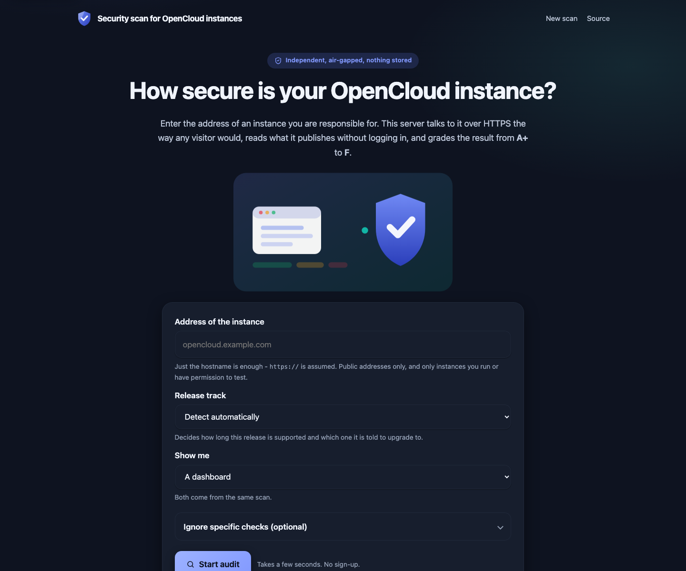
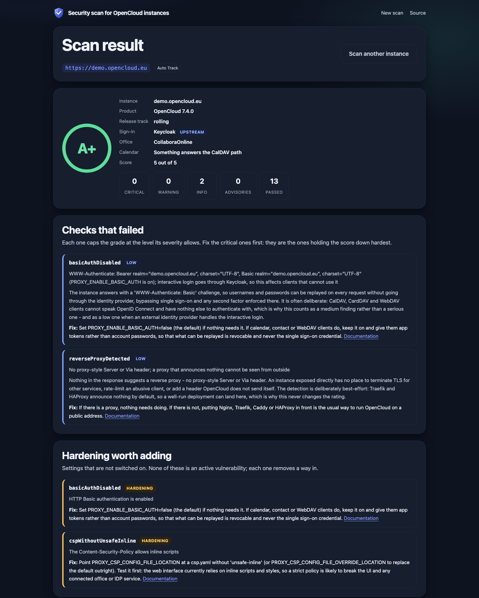

# OpenCloud Scanner

Run a private web frontend for the OpenCloud security scanner. It checks a URL
you submit, shows the security rating in the browser, and keeps results only
temporarily. Try the hosted service at <https://scan.okxo.de>.

Source, deployment files and issue tracking:
<https://github.com/sowoi/check-opencloud-security>





## Pull the image

```bash
docker pull okxo/opencloud-scanner:latest
```

## Run with Docker Compose

The frontend needs a worker and Redis. To use the maintained Compose file:

```bash
git clone https://github.com/sowoi/check-opencloud-security.git
cd check-opencloud-security/docker
docker compose -f docker-compose.dockerhub.yml up -d
```

To run without cloning the repository, save this as `compose.yaml` and run
`docker compose up -d` in the same directory:

```yaml
services:
  redis:
    image: redis:8.10-alpine
    command: >
      redis-server --save "" --appendonly no
      --maxmemory 256mb --maxmemory-policy allkeys-lru
    healthcheck:
      test: ["CMD", "redis-cli", "ping"]
      interval: 10s
      timeout: 3s
      retries: 5

  worker:
    image: okxo/opencloud-scanner:latest
    pull_policy: always
    command: ["python", "-m", "webapp.tasks"]
    depends_on:
      redis:
        condition: service_healthy
    environment:
      COS_WEB_REDIS_URL: redis://redis:6379/0
      COS_WEB_RESULT_TTL: "3600"
      COS_WEB_MAX_WORKERS: "5"
      COS_WEB_SCAN_CONCURRENCY: "4"
      COS_WEB_SCAN_TIMEOUT: "15"
      COS_WEB_JOB_TIMEOUT: "180"
      COS_WEB_ALLOW_PRIVATE_TARGETS: "false"
      COS_WEB_CHECK_DEBUG_PORTS: "false"
      COS_WEB_RELEASES_MODE: "off"
    read_only: true
    tmpfs:
      - /tmp:size=16m
    security_opt:
      - no-new-privileges:true
    cap_drop:
      - ALL

  web:
    image: okxo/opencloud-scanner:latest
    pull_policy: always
    depends_on:
      redis:
        condition: service_healthy
    ports: ["127.0.0.1:8080:8080"]
    environment:
      COS_WEB_REDIS_URL: redis://redis:6379/0
      COS_WEB_RESULT_TTL: "3600"
      COS_WEB_IP_RATE_LIMIT: "10"
      COS_WEB_IP_RATE_WINDOW: "60"
      COS_WEB_TARGET_COOLDOWN: "300"
      COS_WEB_TRUST_FORWARDED_FOR: "false"
      COS_WEB_RELEASES_MODE: "off"
    read_only: true
    tmpfs:
      - /tmp:size=16m
    security_opt:
      - no-new-privileges:true
    cap_drop:
      - ALL
```

## Run with Docker

Create a network and start Redis, the scanner worker and the frontend:

```bash
docker network create opencloud-scanner

docker run -d --name opencloud-scanner-redis \
  --network opencloud-scanner \
  redis:8.10-alpine redis-server --save "" --appendonly no \
  --maxmemory 256mb --maxmemory-policy allkeys-lru

docker run -d --name opencloud-scanner-worker \
  --network opencloud-scanner \
  --read-only --tmpfs /tmp:size=16m \
  --security-opt no-new-privileges:true --cap-drop ALL \
  -e COS_WEB_REDIS_URL=redis://opencloud-scanner-redis:6379/0 \
  -e COS_WEB_MAX_WORKERS=5 -e COS_WEB_SCAN_CONCURRENCY=4 \
  -e COS_WEB_SCAN_TIMEOUT=15 -e COS_WEB_JOB_TIMEOUT=180 \
  -e COS_WEB_ALLOW_PRIVATE_TARGETS=false \
  -e COS_WEB_CHECK_DEBUG_PORTS=false \
  okxo/opencloud-scanner:latest python -m webapp.tasks

docker run -d --name opencloud-scanner-web \
  --network opencloud-scanner \
  -p 127.0.0.1:8080:8080 \
  --read-only --tmpfs /tmp:size=16m \
  --security-opt no-new-privileges:true --cap-drop ALL \
  -e COS_WEB_REDIS_URL=redis://opencloud-scanner-redis:6379/0 \
  -e COS_WEB_IP_RATE_LIMIT=10 -e COS_WEB_IP_RATE_WINDOW=60 \
  -e COS_WEB_TARGET_COOLDOWN=300 \
  -e COS_WEB_TRUST_FORWARDED_FOR=false \
  okxo/opencloud-scanner:latest
```

Open <http://127.0.0.1:8080>. To stop and remove this stack:

```bash
docker rm -f opencloud-scanner-web opencloud-scanner-worker opencloud-scanner-redis
docker network rm opencloud-scanner
```